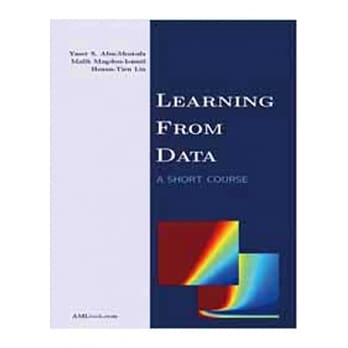

# HsuanTienLin ML Coursera
Coursera 機器學習基石(上) (by Prof. Hsuan Tien Lin)

## Outline
* 第一講：The Learning Problem
   * [01_handout](handout/01_handout.pdf) 
   * [homework#0](homework/homework0.pdf)

## Reference
* LEARNING FROM DATA (ISBN : `9781600490064`)

